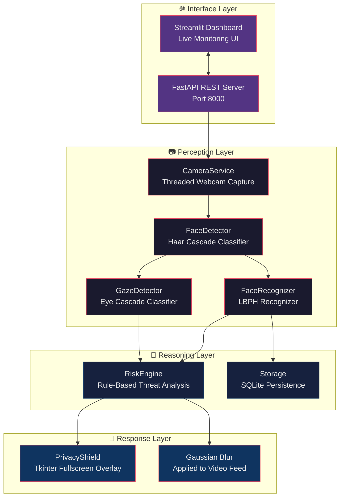
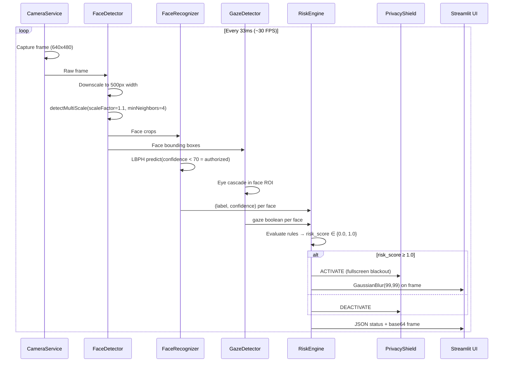
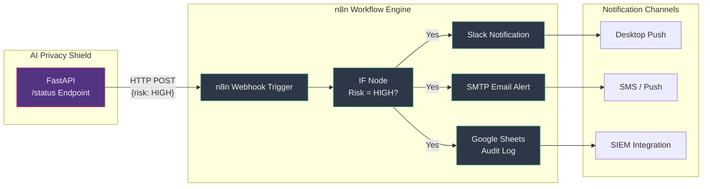

<p align="center">
  
  
  
  
  
</p>

<h1 align="center">🛡️ AI Privacy Shield</h1>
<p align="center">
  <em>Real-time Visual Privacy Protection — On-Device, Zero-Cloud, Zero-Latency</em>
</p>

<p align="center">
  <strong>AI Privacy Shield</strong> is an on-device, real-time visual privacy system that monitors your screen environment via webcam, detects shoulder-surfing and unauthorized viewing using computer vision, and instantly blurs or blacks out the screen when a privacy threat is detected. No cloud, no data leaving your machine.
</p>

---

## 📋 Table of Contents

- [System Architecture](#system-architecture)
- [How It Works](#how-it-works)
- [Tech Stack](#tech-stack)
- [Core Algorithms & Mathematics](#core-algorithms--mathematics)
- [n8n Pipeline Integration](#n8n-pipeline-integration)
- [Code Highlights](#code-highlights)
- [Getting Started](#getting-started)
- [API Reference](#api-reference)
- [Project Structure](#project-structure)
- [Use Cases](#use-cases)
- [License](#license)

---

## 🏗️ System Architecture

The system follows a **pipeline architecture** with four major subsystems operating concurrently:



### Data Flow Sequence



---

## ⚙️ How It Works

1. **Enrollment** — User captures 10–15 face samples via webcam. The LBPH recognizer trains a local model stored as `authorized_user.xml`.
2. **Monitoring** — FastAPI runs two background loops: a **stream loop** (~30 FPS) for real-time display and an **AI loop** (~10 Hz) for detection and risk analysis.
3. **Detection Pipeline** — Each frame passes through face detection (Haar Cascade), face recognition (LBPH), and gaze estimation (Eye Cascade).
4. **Risk Assessment** — The `RiskEngine` applies deterministic rules: multi-face presence or unauthorized gaze triggers HIGH risk.
5. **Response** — On HIGH risk, the PrivacyShield (Tkinter fullscreen overlay) activates and the video feed is blurred via Gaussian blur.

---

## 🛠️ Tech Stack

| Layer | Technology | Version | Purpose |
|-------|-----------|---------|---------|
| **Backend Framework** | [FastAPI](https://fastapi.tiangolo.com/) | 0.95+ | REST API server, async request handling |
| **Web Server** | [Uvicorn](https://www.uvicorn.org/) | 0.21+ | ASGI server for FastAPI |
| **Frontend** | [Streamlit](https://streamlit.io/) | 1.28+ | Real-time monitoring dashboard |
| **Computer Vision** | [OpenCV](https://opencv.org/) | 4.5+ | Face detection, recognition, image processing |
| **Face Recognition** | OpenCV LBPH | — | Local Binary Patterns Histograms |
| **Face Detection** | Haar Cascade | — | Viola-Jones object detection |
| **Desktop Overlay** | Tkinter | stdlib | Fullscreen blackout window |
| **Database** | SQLite | 3.x | Face embedding persistence |
| **IPC** | multiprocessing.Queue | stdlib | Inter-process communication |
| **Concurrency** | threading | stdlib | Parallel camera + AI pipelines |

---

## 🔬 Core Algorithms & Mathematics

### Local Binary Patterns Histograms (LBPH)

The core recognition algorithm is OpenCV's **LBPH Face Recognizer**, a texture-based method that is illumination-invariant and computationally efficient.

#### LBP Operator

For each pixel $p_c$ with coordinates $(x_c, y_c)$, the LBP value is computed by comparing it against its $P$ neighbors at radius $R$:

$$\text{LBP}_{P,R}(x_c, y_c) = \sum_{p=0}^{P-1} s(g_p - g_c) \cdot 2^p$$

where:
- $g_c$ is the gray value of the center pixel
- $g_p$ is the gray value of the $p$-th neighbor
- $s(x)$ is the sign function:

$$s(x) = \begin{cases} 1 & x \geq 0 \\ 0 & x < 0 \end{cases}$$

**Implementation parameters** (from `authorized_user.xml`):
- Radius $R = 1$
- Neighbors $P = 8$
- Grid: $8 \times 8$ cells

#### Histogram Feature Vector

The face image is divided into an $8 \times 8$ grid, yielding 64 cells. Each cell produces a 256-bin histogram of LBP values. The concatenated feature vector has dimensionality:

$$d = \text{grid}_x \times \text{grid}_y \times 256 = 8 \times 8 \times 256 = 16,384$$

#### Chi-Squared Distance

During prediction, the recognizer uses the chi-squared ($\chi^2$) distance between histograms:

$$\chi^2(H_1, H_2) = \sum_{i} \frac{(H_1(i) - H_2(i))^2}{H_1(i) + H_2(i) + \epsilon}$$

Lower values indicate a better match. The confidence threshold is set at **70**: values below 70 are considered authorized, values above are treated as unknown.

```python
# backend/face_recognition.py — LBPH Training & Prediction
class FaceRecognizer:
    def __init__(self):
        self.recognizer = cv2.face.LBPHFaceRecognizer_create()
        self.is_trained = False

    def train(self, face_images):
        labels = np.ones(len(face_images), dtype=np.int32)
        gray_faces = [cv2.cvtColor(img, cv2.COLOR_BGR2GRAY) for img in face_images]
        gray_faces = [cv2.resize(img, (200, 200)) for img in gray_faces]
        self.recognizer.train(gray_faces, labels)
        self.is_trained = True

    def identify(self, face_image):
        gray = cv2.cvtColor(face_image, cv2.COLOR_BGR2GRAY)
        gray = cv2.resize(gray, (200, 200))
        label, confidence = self.recognizer.predict(gray)
        return label, confidence  # confidence < 70 → authorized
```

---

### Haar Cascade Face Detection

The **Viola-Jones framework** uses Haar-like features computed via integral images for rapid object detection.

#### Integral Image

The integral image $I_{\text{int}}(x, y)$ at pixel $(x, y)$ is the sum of all pixels above and to the left:

$$I_{\text{int}}(x, y) = \sum_{x' \leq x, y' \leq y} I(x', y')$$

This enables computing the sum of any rectangular region in $O(1)$ time:

$$\text{Sum}(A, B, C, D) = I_{\text{int}}(D) + I_{\text{int}}(A) - I_{\text{int}}(B) - I_{\text{int}}(C)$$

````ascii
  A ────── B
  │        │
  │  ROI   │
  │        │
  C ────── D
````

**Detection parameters** used in the project:

```python
# backend/face_detection.py — Face Detection with Haar Cascade
class FaceDetector:
    def __init__(self):
        self.face_cascade = cv2.CascadeClassifier(
            cv2.data.haarcascades + 'haarcascade_frontalface_default.xml'
        )

    def detect_faces(self, image):
        height, width = image.shape[:2]
        new_width = 500
        scale = new_width / width
        small_img = cv2.resize(image, (new_width, int(height * scale)))
        gray = cv2.cvtColor(small_img, cv2.COLOR_BGR2GRAY)
        faces_detected = self.face_cascade.detectMultiScale(gray, 1.1, 4)

        faces = []
        for (x, y, w, h) in faces_detected:
            faces.append({
                "bbox": (int(x/scale), int(y/scale), int(w/scale), int(h/scale)),
                "score": 1.0
            })
        return faces
```

---

### Gaze Estimation via Eye Cascade

Gaze is estimated using a heuristic: **if eyes are detected within a face ROI, the person is assumed to be looking at the screen**. This is a proxy measurement using the Haar Cascade for eyes (`haarcascade_eye.xml`).

```python
# backend/gaze_detection.py — Gaze Estimation
class GazeDetector:
    def __init__(self):
        self.eye_cascade = cv2.CascadeClassifier(
            cv2.data.haarcascades + 'haarcascade_eye.xml'
        )

    def process_frame(self, image, faces):
        gray = cv2.cvtColor(image, cv2.COLOR_BGR2GRAY)
        gaze_data = []
        for face in faces:
            x, y, w, h = face["bbox"]
            face_roi_gray = gray[y:y+h, x:x+w]
            eyes = self.eye_cascade.detectMultiScale(face_roi_gray, 1.1, 5)
            gaze_data.append(len(eyes) > 0)  # True = looking at screen
        return gaze_data
```

---

### Risk Engine — Decision Logic

The `RiskEngine` uses a deterministic rule-based system with a binary risk score:

$$\text{risk\_score} = \max\left(\mathbb{1}[\text{multi\_face}],\; \mathbb{1}[\text{unauthorized\_gaze}]\right)$$

where $\mathbb{1}[\cdot]$ is the indicator function.

**Rules:**
1. If `num_faces > 1` → score = 1.0 ("Multiple people detected")
2. For each face: if `label ≠ 1` OR `confidence ≥ 70` AND `gaze == True` → score = 1.0 ("Unauthorized person looking at screen")

```python
# backend/risk_engine.py — Threat Risk Analysis
class RiskEngine:
    def __init__(self, confidence_threshold=70.0):
        self.confidence_threshold = confidence_threshold

    def analyze(self, num_faces, recognitions, gazes):
        risk_score = 0
        reasons = []

        if num_faces > 1:
            risk_score = 1.0
            reasons.append("Multiple people detected")

        for (label, conf), looking in zip(recognitions, gazes):
            if not (label == 1 and conf < self.confidence_threshold):
                if looking:
                    risk_score = 1.0
                    reasons.append("Unauthorized person looking at screen")

        return {
            "risk_level": "HIGH" if risk_score >= 1.0 else "LOW",
            "score": risk_score,
            "reasons": reasons,
            "authorized_present": any(
                label == 1 and conf < self.confidence_threshold
                for label, conf in recognitions
            )
        }
```

---

### FPS / Latency Calculation

Real-time performance is measured as:

$$FPS = \frac{1}{t_{\text{current}} - t_{\text{previous}}}$$

$$\text{Latency (ms)} = \frac{1000}{FPS}$$

### Privacy Shield Activation

**Gaussian Blur** applied to the video frame when risk is HIGH:

$$G(x, y) = \frac{1}{2\pi\sigma^2} \exp\left(-\frac{x^2 + y^2}{2\sigma^2}\right)$$

The blur kernel size is $99 \times 99$ with $\sigma = 0$ (auto-computed from kernel size by OpenCV).

---

## 🔄 n8n Pipeline Integration

While AI Privacy Shield is a standalone on-device application, it can be extended with [n8n](https://n8n.io/) for enterprise alerting and notification workflows. Below is a design for integrating the system with n8n:



### Example n8n Workflow (JSON)

```json
{
  "name": "Privacy Shield Alert Pipeline",
  "nodes": [
    {
      "name": "Webhook Trigger",
      "type": "n8n-nodes-base.webhook",
      "parameters": {
        "path": "privacy-shield-alert",
        "responseMode": "lastNode"
      }
    },
    {
      "name": "Check Risk Level",
      "type": "n8n-nodes-base.if",
      "parameters": {
        "conditions": {
          "string": [
            {
              "value1": "={{ $json.risk_level }}",
              "operation": "equal",
              "value2": "HIGH"
            }
          ]
        }
      }
    },
    {
      "name": "Send Alert",
      "type": "n8n-nodes-base.slack",
      "parameters": {
        "channel": "#security-alerts",
        "text": "⚠️ Privacy Breach Detected\nRisk Level: {{ $json.risk_level }}\nReasons: {{ $json.reasons }}\nTime: {{ $now }}"
      }
    }
  ]
}
```

To integrate, add a webhook callback to the FastAPI `/status` endpoint:

```python
@app.post("/status")
def get_status():
    risk_data = LATEST_RISK_DATA
    if risk_data.get("risk", {}).get("risk_level") == "HIGH":
        requests.post("https://your-n8n-instance/webhook/privacy-shield-alert", json=risk_data)
    return {"status": SYSTEM_STATUS, "frame": LATEST_FRAME_B64, **risk_data}
```

---

## 💻 Code Highlights

### Threaded Camera Service

Lock-protected concurrent frame access ensures no frame drops during heavy AI processing:

`backend/camera_service.py:12-41`

```python
class CameraService:
    def start(self):
        self.cap = cv2.VideoCapture(0, cv2.CAP_DSHOW)
        self.cap.set(cv2.CAP_PROP_FRAME_WIDTH, 640)
        self.cap.set(cv2.CAP_PROP_FRAME_HEIGHT, 480)
        self.cap.set(cv2.CAP_PROP_BUFFERSIZE, 1)
        self.cap.set(cv2.CAP_PROP_FPS, 30)
        self.running = True
        self.thread = threading.Thread(target=self._update, daemon=True)
        self.thread.start()

    def _update(self):
        while self.running:
            ret, frame = self.cap.read()
            if ret:
                with self.lock:
                    self.frame = frame

    def get_frame(self):
        with self.lock:
            return self.frame.copy() if self.frame is not None else None
```

### FastAPI Server with Dual Background Loops

Two concurrent processing loops: one for display (~30 FPS), one for AI analysis (~10 Hz):

`backend/main.py:43-114`

```python
def stream_loop():
    """High-frequency loop for real-time display (30 FPS)."""
    while True:
        frame = camera.get_frame()
        if frame is not None:
            faces = detector.detect_faces(frame)
            crops = detector.get_face_crops(frame, faces)
            recognitions = [recognizer.identify(crop) for crop in crops]
            gazes = gaze_detector.process_frame(frame, faces)
            LATEST_RISK_DATA = risk_engine.analyze(len(faces), recognitions, gazes)

            display_frame = frame.copy()
            for i, face in enumerate(faces):
                x, y, w, h = face["bbox"]
                is_auth = (recognitions[i][0] == 1 and recognitions[i][1] < 70)
                color = (0, 255, 0) if is_auth else (0, 0, 255)
                cv2.rectangle(display_frame, (x, y), (x+w, y+h), color, 2)

            if LATEST_RISK_DATA.get("risk_level") == "HIGH":
                display_frame = cv2.GaussianBlur(display_frame, (99, 99), 0)

            _, buffer = cv2.imencode('.jpg', display_frame, [cv2.IMWRITE_JPEG_QUALITY, 50])
            LATEST_FRAME_B64 = "data:image/jpeg;base64," + base64.b64encode(buffer).decode('utf-8')
        time.sleep(0.03)

def ai_loop():
    """Lower-frequency loop for heavy AI processing (10 Hz)."""
    while True:
        frame = camera.get_frame()
        if frame is not None:
            faces = detector.detect_faces(frame)
            num_faces = len(faces)
            crops = detector.get_face_crops(frame, faces)
            recognitions = [recognizer.identify(crop) for crop in crops]
            gazes = gaze_detector.process_frame(frame, faces)
            risk_data = risk_engine.analyze(num_faces, recognitions, gazes)
            LATEST_RISK_DATA = {"num_faces": num_faces, "risk": risk_data}
        time.sleep(0.1)
```

### Privacy Shield — Tkinter Fullscreen Overlay

Cross-process GUI management using `multiprocessing.Queue`:

`backend/privacy_shield.py:5-69`

```python
def _run_shield(queue):
    root = tk.Tk()
    root.title("Synapse Privacy Shield")
    root.configure(bg='black')
    root.attributes('-fullscreen', True)
    root.attributes('-topmost', True)
    root.withdraw()

    label = tk.Label(root, text="⚠️ ACCESS DENIED ⚠️\nUNAUTHORIZED VIEWER DETECTED",
                     font=("Courier New", 40, "bold"), fg="red", bg="black")
    label.pack(expand=True)

    def check_queue():
        while not queue.empty():
            msg = queue.get_nowait()
            if msg == "SHOW":
                root.deiconify()
            elif msg == "HIDE":
                root.withdraw()
            elif msg == "EXIT":
                root.destroy(); return
        root.after(100, check_queue)

    root.after(100, check_queue)
    root.mainloop()
```

---

## 🚀 Getting Started

### Prerequisites

- Python 3.8+
- Webcam

### Installation

```bash
# Clone the repository
git clone https://github.com/yourusername/ai-privacy-shield.git
cd ai-privacy-shield

# Backend setup
cd backend
python -m venv venv
# Windows:
.\venv\Scripts\activate
# Linux/macOS:
# source venv/bin/activate

pip install -r requirements.txt
python main.py
```

The FastAPI server starts at **`http://localhost:8000`**.

### Frontend (Streamlit Dashboard)

Open a new terminal:

```bash
cd frontend
streamlit run app.py
```

Navigate to **`http://localhost:8501`**.

---

## 📡 API Reference

| Endpoint | Method | Description |
|----------|--------|-------------|
| `/status` | `GET` | Returns current risk data + base64-encoded video frame |
| `/enroll` | `POST` | Starts enrollment: captures 10 face samples and trains LBPH model |
| `/start-monitoring` | `POST` | Begins monitoring (requires trained model) |

### `/status` Response

```json
{
  "status": "MONITORING",
  "frame": "data:image/jpeg;base64,...",
  "num_faces": 1,
  "risk": {
    "risk_level": "LOW",
    "score": 0.0,
    "reasons": [],
    "authorized_present": true
  }
}
```

---

## 📁 Project Structure

```
ai-privacy-shield/
├── backend/
│   ├── main.py              # FastAPI server, background loops, endpoints
│   ├── camera_service.py    # Threaded webcam capture (30 FPS, 640x480)
│   ├── face_detection.py    # Haar Cascade face detection
│   ├── face_recognition.py  # LBPH face recognition (train, identify, save/load)
│   ├── gaze_detection.py    # Eye Cascade gaze estimation
│   ├── risk_engine.py       # Rule-based privacy threat analysis
│   ├── privacy_shield.py    # Tkinter fullscreen overlay (multiprocess)
│   ├── storage.py           # SQLite face embedding persistence
│   ├── requirements.txt     # Python dependencies
│   └── authorized_user.xml  # LBPH trained model (auto-generated)
├── frontend/
│   ├── app.py               # Streamlit monitoring dashboard
│   └── authorized_user.xml  # Model copy for frontend access
└── README.md
```

---

## 🎯 Use Cases

| Scenario | How AI Privacy Shield Helps |
|----------|---------------------------|
| **🏦 Online Banking** | Masks screen when strangers appear behind you in public |
| **📝 Exam Proctoring** | Detects gaze away + multi-face to flag cheating attempts |
| **🏥 Healthcare (EHR)** | Masks patient data when unauthorized personnel are detected |
| **💼 Remote Work** | Protects confidential business documents in co-working spaces |
| **📚 Education** | Prevents shoulder-surfing during online quizzes |
| **🔬 Research Labs** | Shields sensitive data on shared monitors |

---

## 🔒 Privacy & Security

- **100% On-Device**: All face detection, recognition, and processing happens locally. No data is ever sent to external servers.
- **No Persistent Storage of Raw Images**: Only LBPH histogram data is saved (a statistical descriptor, not a reconstructable image).
- **Single-User Mode**: The system is designed for one authorized user per device.

---

## 📄 License

Distributed under the **MIT License**. See `LICENSE` for more information.

---

<p align="center">
  Built with ❤️ for privacy-first computing
  <br>
  <a href="https://github.com/yourusername/ai-privacy-shield/issues">Report a Bug</a>
  ·
  <a href="https://github.com/yourusername/ai-privacy-shield/discussions">Feature Requests</a>
</p>
